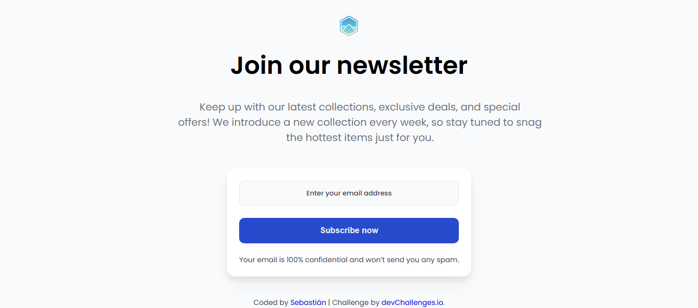

<!-- Please update value in the {}  -->

<h1 align="center">Join Our Newsletter | devChallenges</h1>

   Solution for a challenge <a href="https://devchallenges.io/challenge/join-our-newsletter" target="_blank">Join Our Newsletter</a> from <a href="http://devchallenges.io" target="_blank">devChallenges.io</a>.

  <h3>
    <a href="https://sebascode20.github.io/newsletter-page/">
      Demo
    </a>
     | 
    <a href="https://github.com/Sebascode20/newsletter-page">
      Solution
    </a>
     | 
    <a href="https://devchallenges.io/challenge/join-our-newsletter">
      Challenge
    </a>
  </h3>

## Table of Contents

- [Overview](#overview)
  - [What I learned](#what-i-learned)
  - [Useful resources](#useful-resources)
- [Built with](#built-with)
- [Features](#features)
- [Acknowledgements](#acknowledgements)
- [Author](#author)

## Overview

Newsletter signup page with a responsive design and subscription form.

- Clear headline: “Join our newsletter”
- Description text: exclusive deals, weekly new collections, no spam
- Form with email field and “Subscribe now” button
- Footer with author credit and link to devChallenges

### What I learned

- Semantic HTML usage (`<main>`, `<form>`, `<footer>`) for accessibility
- Responsive design using modern CSS and relative units
- Best practices for form UI: clear placeholder, privacy reassurance
- Improved structure and comments organization

### Useful resources

- [DevChallenges Join Our Newsletter](https://devchallenges.io/challenge/join-our-newsletter) - challenge requirements
- [MDN HTML guide](https://developer.mozilla.org/en-US/docs/Web/HTML) - semantic element reference
- [MDN CSS guide](https://developer.mozilla.org/en-US/docs/Web/CSS) - layout, flexbox, form styling

### Built with

- HTML5
- CSS3
- Responsive design
- Semantic markup

## Features

- Responsive landing page for newsletter subscription
- Links to favicon and external fonts
- Email privacy message: 100% confidential and no spam
- SEO meta tags: description and keywords aligned with content

## Acknowledgements

- devChallenges for the challenge and inspiration
- MDN resources for HTML/CSS references

## Author

- GitHub [@sebascode20](https://github.com/Sebascode20)
- Personal project based on a devChallenges challenge

